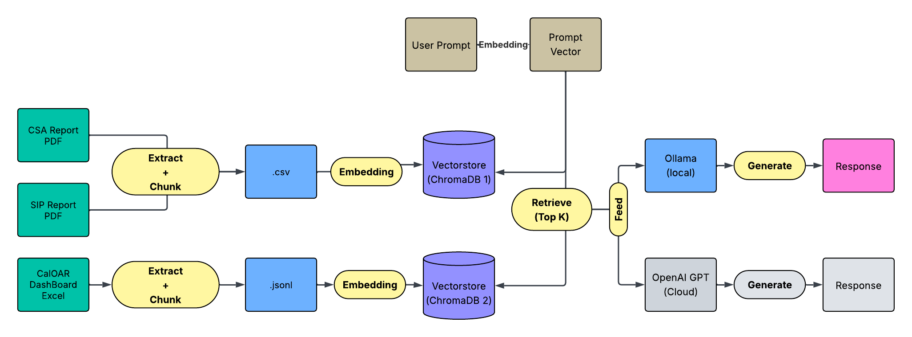

# CalWORKs RAG System (Policy Lab)

This repository implements a **Retrieval-Augmented Generation (RAG)** system designed to support policy analysis of **CalWORKs county-level reports**, including CSA & SIP documents and structured dashboard indicators.

The system enables analysts to query large volumes of unstructured PDFs and structured Excel data using natural language, with configurable local and cloud-based LLM backends.

---

## Project Overview

Public assistance programs such as CalWORKs generate extensive county self-assessment reports and monitoring data.  
However, these documents are often fragmented across formats and difficult to analyze at scale.

This project addresses that challenge by:
- Building a document ingestion and embedding pipeline for policy reports
- Supporting hybrid retrieval over text reports and numeric indicators
- Providing a lightweight UI for interactive policy exploration

---

## System Architecture

The system follows a standard **RAG pipeline** with a clear separation between offline processing and online inference.

📄 **Detailed architecture documentation:**  
➡️ [`docs/architecture.md`](docs/architecture.md)



---

## Data Sources

This project works with the following data types:

- **Unstructured text**
  - CSA (County Self-Assessment) reports (PDF)
  - SIP (System Improvement Plan) reports (PDF)

- **Structured indicators**
  - CalOAR dashboard metrics (Excel)

> ⚠️ Data in this repository is used for demonstration and research purposes only.

---

## Key Features

- Modular ingestion pipeline (extract → chunk → embed)
- Metadata-aware chunking by county and report section
- Separate vector stores for text reports and structured indicators
- Configurable embedding models
- Dual LLM backends:
  - Local inference via **Ollama**
  - Cloud inference via **OpenAI GPT**
- Interactive UI built with **Gradio**

---

## Repository Structure

```text
.
├── app/                # Application entry points (UI + runtime)
│   ├── application.py
│   └── ui.py
│
├── pipeline/           # Core RAG logic
│   ├── ingestion/
│   ├── chunking/
│   ├── embedding/
│   └── retrieval/
│
├── data/               # Raw and processed data (not all tracked)
├── docs/               # System documentation
│   ├── architecture.md
│   └── architecture/
│
├── assets/             # Images used in docs and UI
├── logs/               # Query and system logs
├── requirements.txt
└── README.md
```

## How to Run
Install dependencies: pip install -r requirements.txt

Launch the application: python app/ui.py

## Project Status

This project represents a **functional policy analysis platform** built on a Retrieval-Augmented Generation (RAG) architecture.

It is designed to be practically usable by policy analysts and researchers, with modular components that allow for future scaling, model replacement, and deployment in production-like environments.