# System Architecture

## 1. Design Goals

The primary design goal of this system is to support accurate, transparent, and policy-relevant analysis of county-level CalWORKs performance data. The system is intended to assist analysts and policymakers in exploring both qualitative self-assessment narratives (CSA/SIP reports) and quantitative outcome trends (Cal-OAR dashboard data) through a unified question-answering interface.

A key objective is to preserve the integrity of the underlying data. Rather than generating speculative or overly generalized responses, the system prioritizes faithful summarization of retrieved evidence, explicit citation of source material, and clear communication of uncertainty when data are missing, limited, or inconsistent across sources. This is particularly important in a government and policy context, where analytical conclusions may inform program evaluation or administrative decision-making.

The system is also designed with flexibility and extensibility in mind. By modularizing the embedding layer, retrieval strategy, and language model backend, the architecture allows for rapid experimentation with alternative models and retrieval configurations without restructuring the entire pipeline. This design supports future expansion to additional datasets, indicators, or reporting periods while maintaining reproducibility and transparency.

Finally, data governance and operational constraints are treated as first-class considerations. The system is designed to operate in environments where external API calls may be restricted, enabling local deployment of both embedding models and large language models when required. This ensures that sensitive administrative data can be analyzed securely while still benefiting from modern retrieval-augmented generation techniques.

---

## 2. High-Level Overview

There are two parts of building the LLM Model: 
- Building the database.
- Building the LLM Model backend.

Below is the flowchart of the overall model architecture

---

## 3. Offline Data Pipeline

  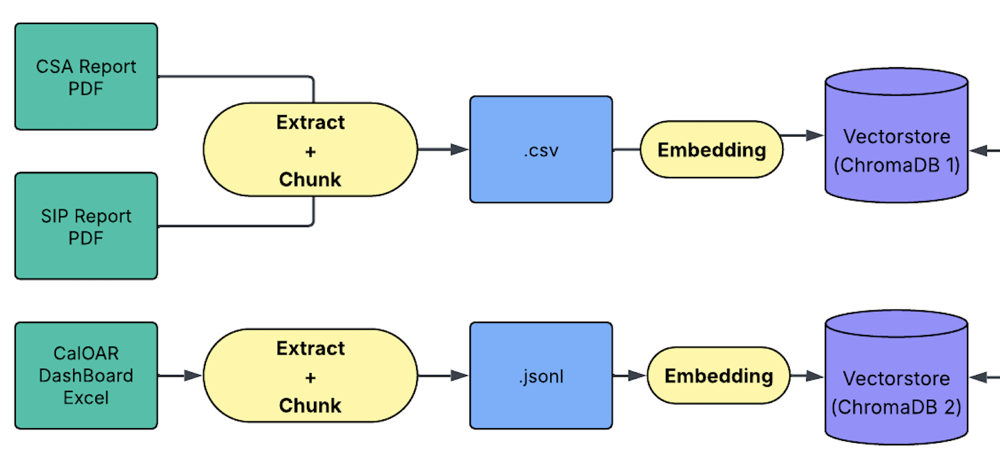

The two main processes of building the initial vector databases are extraction and embedding.
The databases contain three main sources of raw data: CAS reports, SIP reports, and the CalOAR Data Dashboard. 

Since the reports primarily use qualitative information and the dashboard uses quantitative information, we used separate pipelines to extract, embed, and store the data in dual vector stores. 

### PDF extraction

To efficiently extract all information from the PDFs, we use PyMuPDF to scan all pages of the original documents and save the chunked text (up to 900 characters) in an Excel file. 

The CSA reports and SIP reports for all counties are structured in a consistent format. 

The CSA reports follow this structure: 
- Introduction
- Demographics
- Section (Section 1, Section 2,  etc.)

The SIP reports follow this structure:
- Executive Summary
- Introduction
- Section (Section 1, Section 2, etc.)

The extraction pipeline follows the structure of the original report, extracts information from each section, and saves the section name (e.g., Demographics, Section 1, Part 1) along with the source page number. If the original text spans multiple pages, the page numbers will be stored as a list of integers. (eg. [4, 5]).
Here’s an example of how the data is extracted from the second page of the San Diego SIP report.

The information highlighted in red is stored in the section columns, the items in blue correspond to the text columns, and the item in orange represents the page number.
In the previous implementation, the team used the first page number of each section as the stored page reference. This approach made it difficult for users to accurately locate the original source data.

We updated the method to store the exact page number for each entry, which significantly improves traceability and ease of verification.

  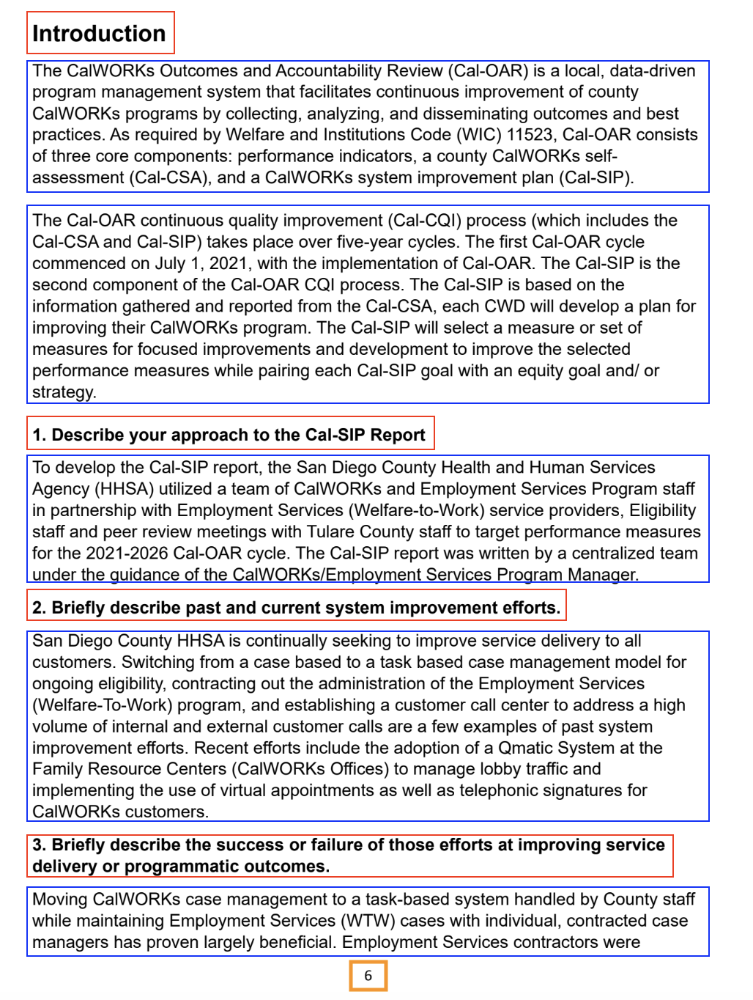

  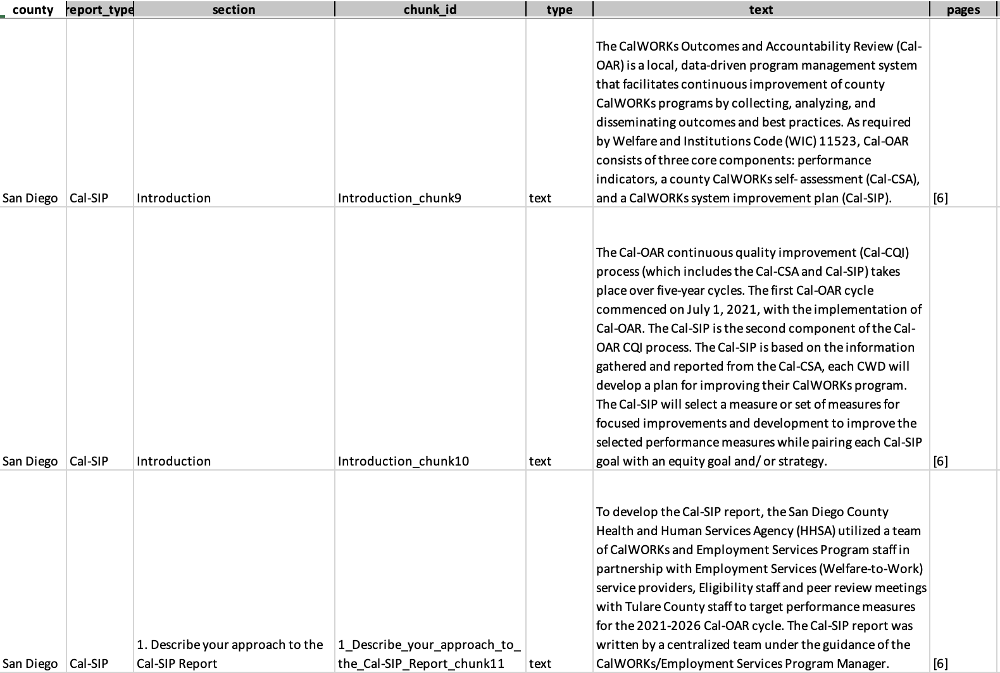

  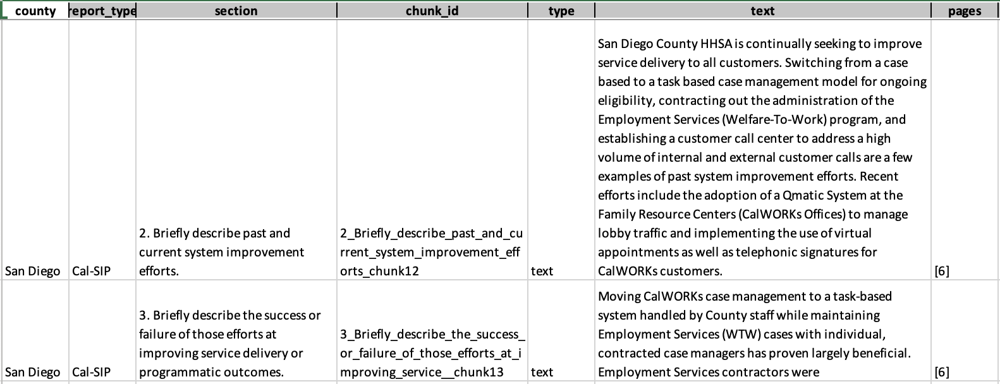

The reports include text, tables, and charts. If we store the table as plain text, several rows will be stored together and treated as a single sentence. This will significantly reduce the accuracy of the final response generated by the LLM. To solve this problem, we label the data type of the original data (text or table) and store the entire table in a single cell.

Below is an example from the Los Angeles CSA report (page 17). 

    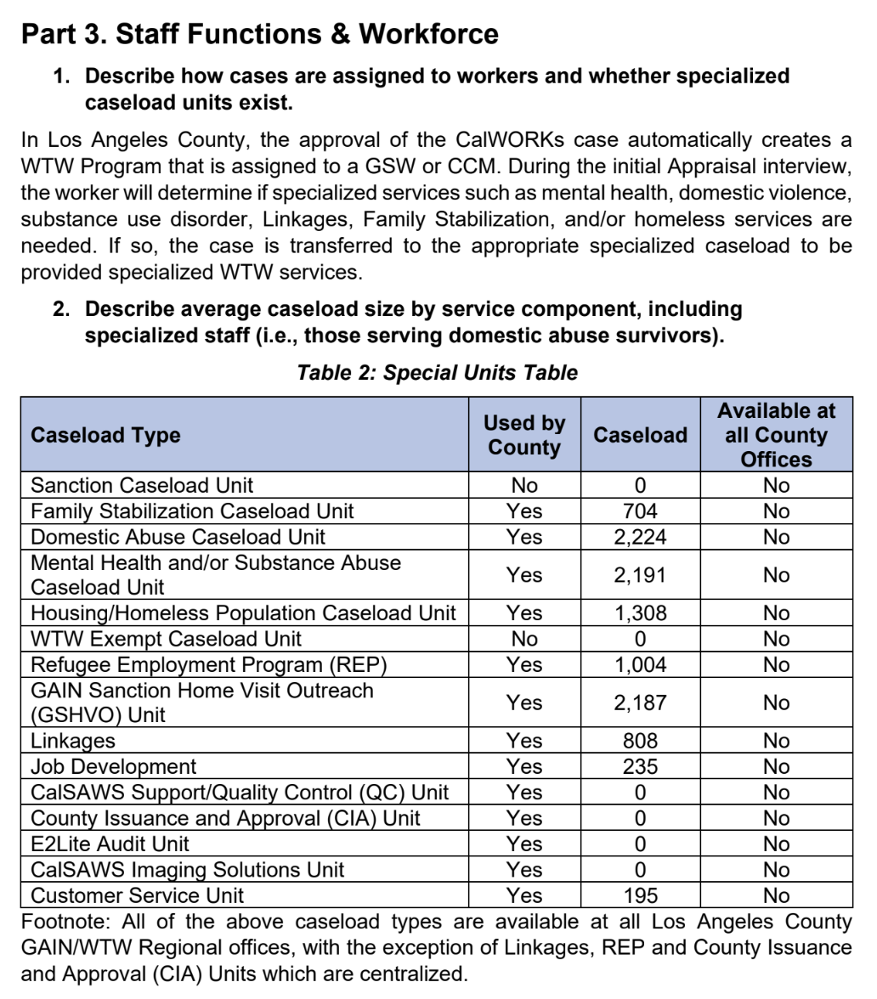

    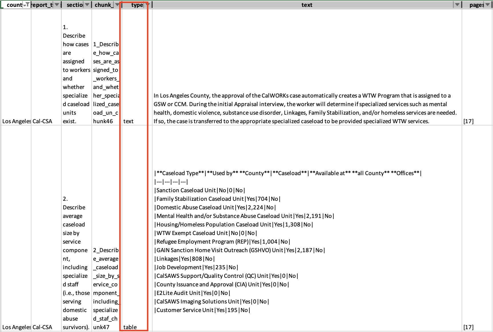

### Dashboard processing
The data dashboard contains 15 tabs, each displaying a single key field for all counties from 2017 to 2024. 

The fifteen fields include: 
Employment Rate, Wage Progression, Post CalWORKs Employment Rate, Exit with Earnings, Program Reentry, Reentry after Exit with Earnings, Orientation Attendance Rate, OCAT Timeliness Rate, First Activity Rate, Sanction Rate, Sanction Resolution Rate, Ancillary Access Rate, OCAT Appraisal to Next Activity, Education and Skills Dev Rate, Family Stabilization WTW Engagement Rate.

Except for the tables on Employment Rate, Wage Progression, Post-CalWORKS Employment Rate, Exit with Earnings, Program Reentry, and Reentry after Exit with Earnings, all other tables contain an excessive number of missing values, hindering statistical analysis. In this round of analysis, we decided to drop these tables and use only the four with sufficient information for extraction. 

One example of a useful table is the Employment Rate table. Although it has some missing values, it contains a substantial amount of data.

    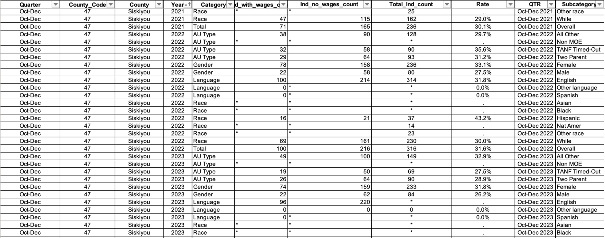

One example of a hard-to-use table is the Sanction Resolution Rate. We can see it contains mostly missing values.

    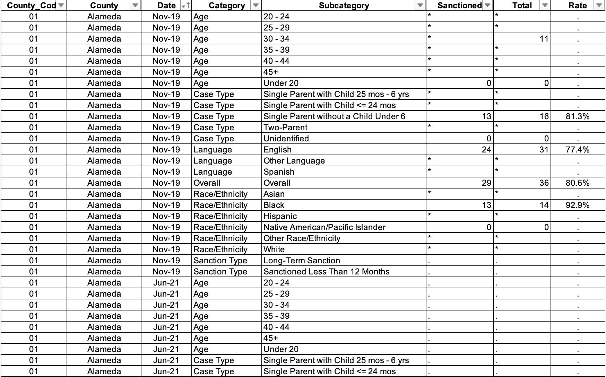

Data from each relevant dashboard will be grouped by county name, category, and subcategory. 

For each group, we will compute the mean, median, standard deviation, minimum, maximum, earliest available year, latest available year, value change, sample rate, and the linear regression–based rate of change.

The earlier example of the employment rate of Siskiyou will be stored like this.

    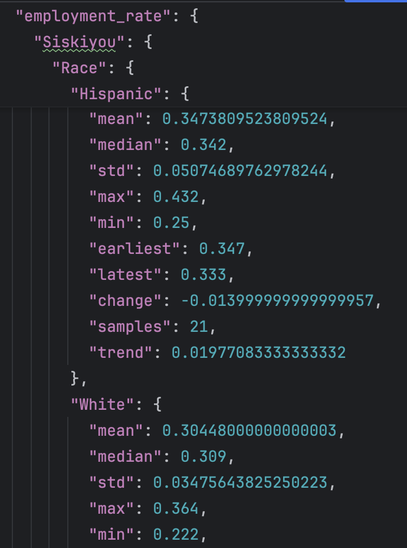

After generating the statistical results, we need to convert them into a format that the embedding model can process efficiently. 
To do this, we concatenate the numerical values into a structured sentence and store it in a separate file. 

    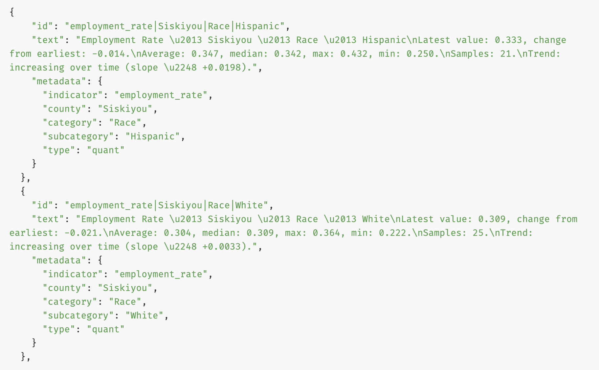

### Dual vector stores
At this stage, all raw data has been transformed into a format suitable for embedding. We use the ***BAAI/bge-m3*** model as our embedding model, as it handles numerical information effectively and supports a large token capacity.

During the embedding process, the chunked table header in the CSA/SIP reports is stored as metadata for future retrieval, along with the table name, county name, category, and subcategory for the data dashboard. 

We stored the vector data in two separate vector stores for future retrieval accuracy. 

## 4. Online Query Flow
The model's backend is built on the **RAG** architecture, which stands for retrieval-augmentation-generation. We chose an open-sourced LLM Model as the backbone for the RAG system. The model we use is ***Mistral:7b***, with 7 billion vector parameters. Setting ***gpt-3.5-turbo*** as the benchmark, after [several rounds of testing](evaluation.md), we found out mistral:7b shows a similar level of performance with gpt-3.5-turbo.

Below is the RAG pipeline flowchart. I will go through the process step by step.

    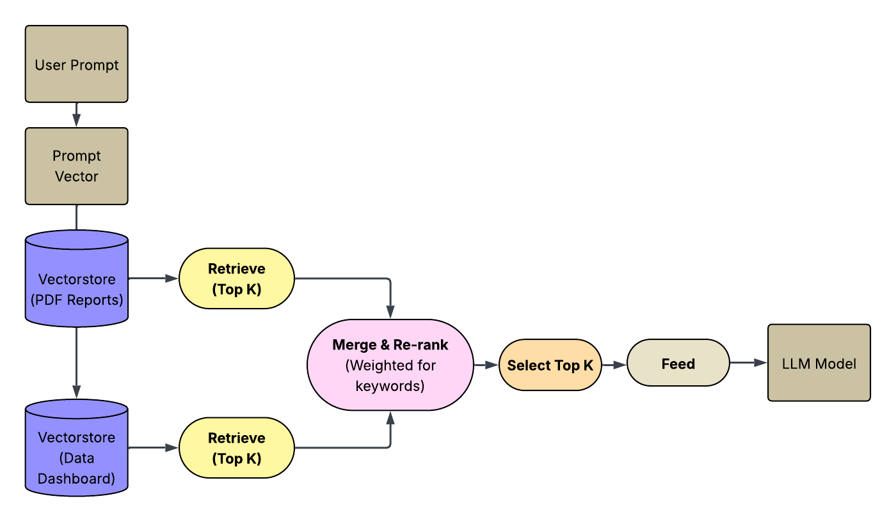

### Retrieval

After the user enters the prompt (the question in natural language), it is converted into vector data (readable by the LLM). The LLM will query the two vector databases we built and retrieve the *top K* (customizable) most-relevant results from both. 

### Reranking

Since this is a dual-vectorstore architecture, another important step is to rerank the search results and feed the most relevant ones to the LLM later.

The re-ranking algorithm is based on the raw data. Many reports use the data dashboard as their primary source for quantitative analysis, but sometimes they cite incorrect numbers. The CalOAR data dashboard provides more accurate numerical data than the CSA/SIP reports. 

However, the nature of LLMs always assigns higher scores to numerical data (though counterintuitively, a higher score means lower relevance) because it contains fewer relevant characters. To solve this problem, we give higher weight when quantitatively indicated keywords ("trend", "trends", "over time", "change", "changes", "rate", "rates", "increase", "decrease", "improve", "decline", "growth", "drop") are mentioned.

This process increases the likelihood that dashboard data will appear in the final response, but it also introduces a new problem: irrelevant categories and subcategories may be retrieved. For example, if the user requests changes in female employment rates in Los Angeles since 2017, the model may still return information about the Hispanic population in Los Angeles. 

To prevent this, we add an additional filter that restricts the model to increasing weight only for the specified category and subcategory mentioned in the user query.

### Augmentation

The model will use the top K retrieved results to generate a summary. If only one county is mentioned in the user query, the model will simply summarize it. If multiple counties are specified, the model will perform a state-level comparison and then generate the summary. 

Since there can be discrepancies between the CSA/SIP reports and the data dashboard, we instruct the LLM to inform the user when the conclusions differ between the two sources (e.g., different time spans, different groups and subgroups, incorrectly cited numbers, etc.).

**Example**

**User query:**  
*Are there any trends in the reentry rate over time in Orange County?*

**Model output:**  
The model summarizes the findings and notes that *“it’s important to note that these trends may differ for specific gender groups.”*

    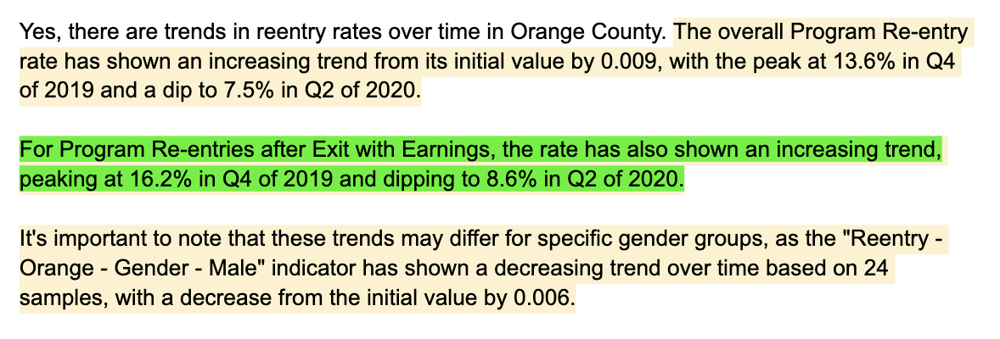

### Generation

The final step, Generation, will provide users with a summary of the findings and the original sources. The original sources include a title showing the county name, report type (CSA report/SIP report/Cal-OAR data dashboard), section (section name/group/subgroup), and page number (for CSA/SIP reports), as well as the original text.

**Summary**

    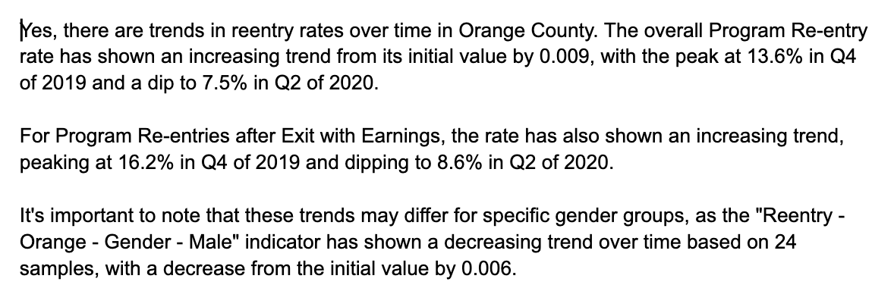

**CSA report excerpt**

    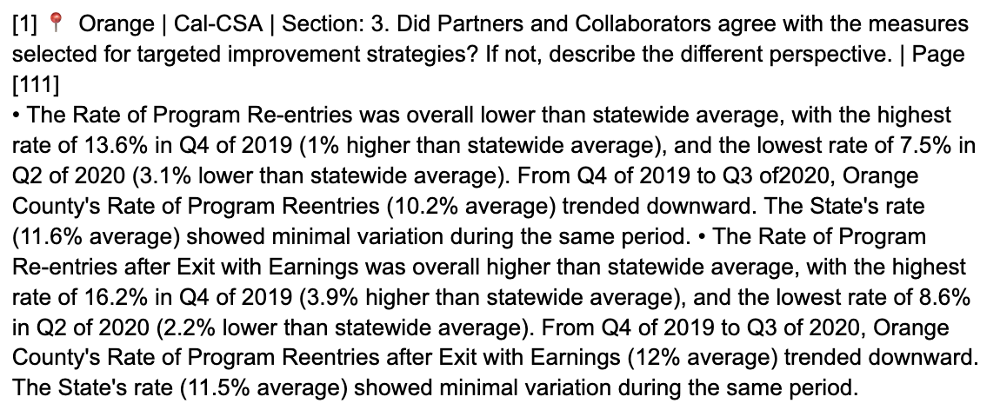

**Data-dashboard excerpt**

    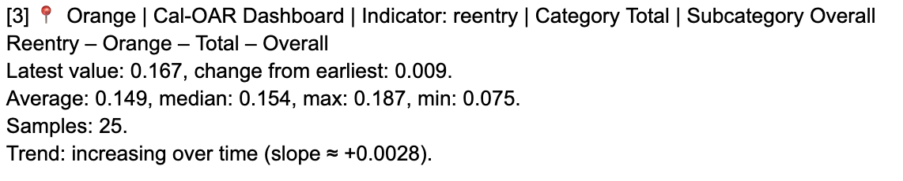

## 5. Model & Design Decisions

This section explains the key architectural and modeling choices made in the system design, along with the trade-offs considered.

### Why Dual Vector Stores

We adopt a dual vector store architecture to accommodate the fundamentally different characteristics of the raw data sources.

The CSA and SIP reports primarily consist of qualitative, narrative text (e.g., policy descriptions, contextual explanations, and summaries), whereas the CalOAR data dashboard contains structured, quantitative time-series data. Embedding these two data types into a single vector store would reduce retrieval accuracy, as the semantic signals and token distributions differ substantially between textual and numerical representations.

By separating the data into two vector stores—one optimized for qualitative report text and the other for quantitative dashboard summaries—we improve retrieval precision and enable more targeted reranking strategies during query processing. This design allows the system to surface the most appropriate evidence depending on whether the user query emphasizes trends, numerical changes, or qualitative interpretation.

---

### Why BAAI/bge-m3 for Embeddings

We selected **BAAI/bge-m3** as the embedding model due to its strong performance on mixed-content embeddings and its ability to handle both textual and numerically structured inputs effectively.

Unlike many embedding models optimized solely for natural language, bge-m3 demonstrates robust performance when embedding concatenated numerical summaries (e.g., means, trends, and regression-based rate changes). Additionally, the model supports a large token capacity, which is essential for embedding long report sections and structured statistical descriptions without excessive truncation.

From a practical standpoint, bge-m3 provides a favorable balance between embedding quality, inference speed, and computational cost, making it well-suited for large-scale document ingestion and iterative experimentation.

---

### Why Mistral over GPT-based Models

We chose **Mistral:7B** as the backbone LLM for the RAG system after evaluating performance, deployment constraints, and data governance considerations.

While proprietary models such as GPT-3.5-turbo offer strong baseline performance, they require external API calls and external data transmission, which raises concerns for government and policy-oriented use cases involving sensitive administrative data. Mistral, as an open-source model, can be deployed locally, ensuring that all data processing remains within a controlled environment.

Empirical evaluation showed that Mistral:7B achieves comparable response quality to GPT-3.5-turbo for the targeted analytical tasks, particularly for summarization and comparative analysis across counties. Given its local deployability, transparency, and competitive performance, Mistral provides a more appropriate solution for secure, policy-focused applications.