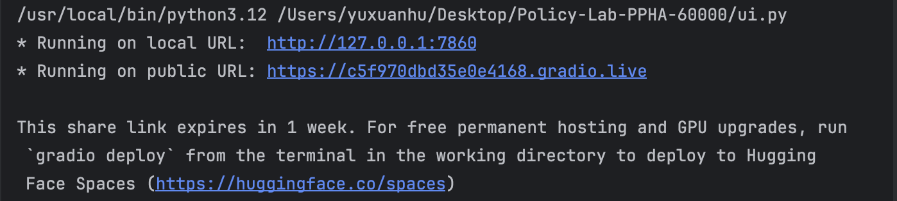
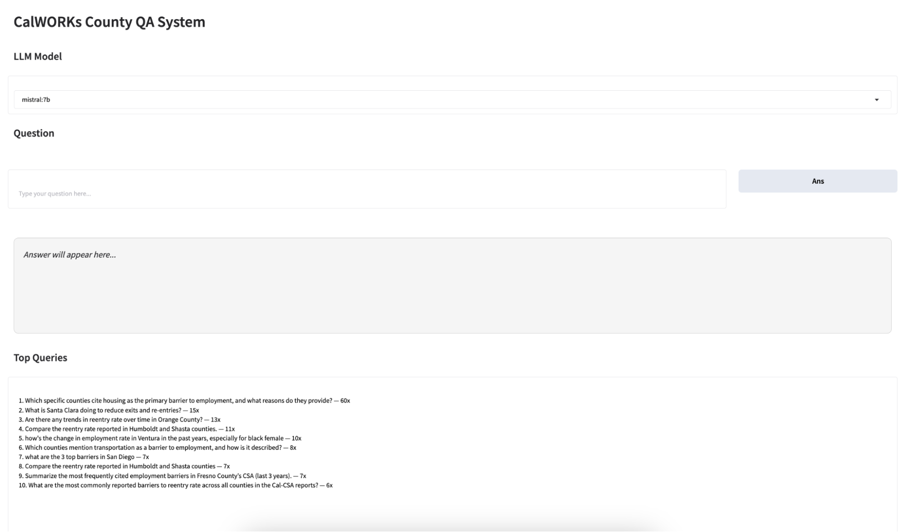

# Download Pre-built Vector Databases

Due to GitHub file size limits, the pre-built vector databases are not tracked in this repository.

Please download them separately from Google Drive and place them in the correct directory.

## Step 1: Download the vector databases

Download the folder from Google Drive:

> 🔗 [Google Drive Download Link](https://drive.google.com/drive/folders/1a5670fJZs36StnebNV3MKptbbmvzvmDA?usp=drive_link)

## Step 2: Create the embedding/ directory

At the project root, create a folder named embedding:

```bash
mkdir -p embedding
```

## Step 3: Place the vector databases

After downloading, move the three folders into embedding/ so that your directory structure looks like this:

```text
root/
├── embedding/
│   ├── chroma_jsonl_db[Huggingface Embedding]/
│   ├── chroma_sip_csa_db[Huggingface Embedding]/
│   └── chroma_sip_csa_db[openai_embed3]/
├── data/
├── pipeline/
├── app/
├── logs/
├── docs/
├── asset/
└── README.md
```

*(Optional) Automated download via script*

If you have gdown installed, you can download the vector databases automatically:

```bash
pip install --user gdown
chmod +x get_data.sh
./get_data.sh
```

# Run the Application (Ollama + Mistral)

This project uses **Ollama** to run a local LLM (Mistral 7B).

## Step 1: Install Ollama

Download and install Ollama from the official website:

> 🔗 [Ollama Download](https://ollama.com/download)

## Step 2: Download the Mistral 7B model

Pull the required model:

```bash
ollama pull mistral:7b
```
*This may take several minutes depending on your internet speed.*

## Step 3: Install Python Dependencies

From the project root directory, install all required packages:

```bash
pip install -r requirements.txt
```

## Step 4: Strat the Ollama Service

Run Ollama in the background:

```bash
ollama serve
```
Leave this process running while using the application.

## Step 5: Launch the application UI

Go to the app folder, locate and run the ui.py file:

```bash
python ui.py
```
After the program starts, a local webpage link will appear in the console.

Click either of the links to open the web interface in your browser.

<p align="center">
    
<p>

# Alternative Backend: OpenAI (GPT-3.5)

In addition to the local Ollama + Mistral setup, this project also supports an **OpenAI** backend using **GPT-3.5-Turbo**.

## Step 1: Complete the Basic Setup
Before using the OpenAI backend, make sure you have already:
- Installed all Python dependencies
- Downloaded the required vector databases
- Successfully run the project once (following the steps above)

## Step 2: Obtain an OpenAI API key
If you do not already have an API key, you can register and create one here:
> 🔗 [OpenAI API Keys](https://platform.openai.com/api-keys)

## Step 3: Configure your OpenAI API key
- Navigate to the project **root directory**.
- Open the file
```text
application.py
```
- Locate the section labeled
```text
# Load API keys
```
- Find the following line:
```text
os.environ["OPENAI_API_KEY"] = ""
```
- Paste your OpenAI API key inside the quotation marks:
```text
os.environ["OPENAI_API_KEY"] = "YOUR_API_KEY_HERE"
```

## Step 4: Run the Application
After setting the API key, run the application as usual:

```text
python ui.py
```
The system will now use **gpt-3.5-turbo** as the backend model.

# Reload the Database
If you need to reload the vector database (you may need to update the databases when you get new data, e.g., new CSA reports), find the pipeline folder under the root folder.

## Extract PDF Information

For new pdf files, run:
```text
extraction_pdf.py
load_xl.py
```
The extract_pdf.py extracts information from CSA and SIP reports. 

To run it, you can either download all the PDFs from the [Google Drive](https://drive.google.com/drive/folders/1p_LMpi1YKdgAItx1U3C8OyoEozjY5zyR?usp=drive_link)

Or you can mount the Google Drive folder where all the PDFs are stored.

To mount the Google Drive to your local directory, you need to download [rclone](https://rclone.org/downloads/)

For MAC, use macOS ARM64 (for M1/M2/M3 machines)

Inside the unzipped folder, run:

```bash
cd ~/Downloads/rclone-*-osx-arm64
sudo install -m 755 rclone /usr/local/bin/rclone
rclone config
mkdir -p ~/gdrive
```
Follow all steps in the console. Then allow the pc to access all files in your drive:
```bash
rclone mount gdrive: ~/gdrive --vfs-cache-mode full
```

You can now access the Google Drive folder from your local directory.

In “extraction_pdf.py” file, find 
```text
PDF_DIRECTORY
```
After running the file, it will save a new Excel file to the data folder.

In the double quote, put your directory. It should be in the format: 
```text
“/Users/<YOURNAME>/gdrive/CalWorks/Vector Database/PDFs”
```
Now, you can safely run the file *load_xl.py* for embedding.

Make sure the change the refresher to TRUE.
```text
vs = build_jsonl_vectorstore(refresh=TRUE)
```

If you are using a CUP, find the function *build_jsonl_vectorstore*, keep device in *model_kwargs* as cpu.
```text
def build_jsonl_vectorstore(refresh=TRUE):
    embedding_func = HuggingFaceEmbeddings(
        model_name="BAAI/bge-m3",
        model_kwargs={"device":"cpu"},
        encode_kwargs={"normalize_embeddings":True}
    )
```

If you are using a GPU, set the device value to cuda.
```text
def build_jsonl_vectorstore(refresh=TRUE):
    embedding_func = HuggingFaceEmbeddings(
        model_name="BAAI/bge-m3",
        model_kwargs={"device":"cuda"},
        encode_kwargs={"normalize_embeddings":True}
    )
```

## Extract Data Dashboard Information

For new data dashboard files, run:
```text
extract_df.py
json_for_embedding.py
load_json.py
```
The *extract_df.py* file extracts information from CalOAR data dashboard.

You can find the raw dashboard data under
```text
root/data/dashboard_raw_data.xlsx
```

Run *extract_df.py*. It will save a JSON file to the data folder. 

The new file will be 
```text
root/data/dashboard_quant_stats.json
```

This file contains machine-readable quantitative statistics, but is not yet suitable for direct embedding.
Embedding models require natural-language inputs rather than raw numeric tables.

To convert dashboard statistics into descriptive text, run:
```bash
python pipeline/json_stats_to_docs.py
```

It will save a new JSON file to the data folder 
```text
root/data/dashboard_quant_docs.json
```

Now, you can safely run the file *load_json.py* for embedding. 
>⚠️ Important:
Ensure that your environment and device settings (local vs. cloud embeddings) are configured correctly.
Follow the same setup instructions described in Extract PDF Data before running this step.

# Interface

The interface has four main parts:
- Model Selection
- Prompt Input
- Model Response
- Top Queries

<p align="center">
    
<p>